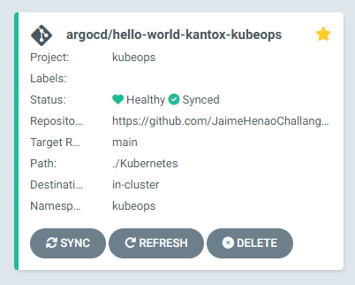
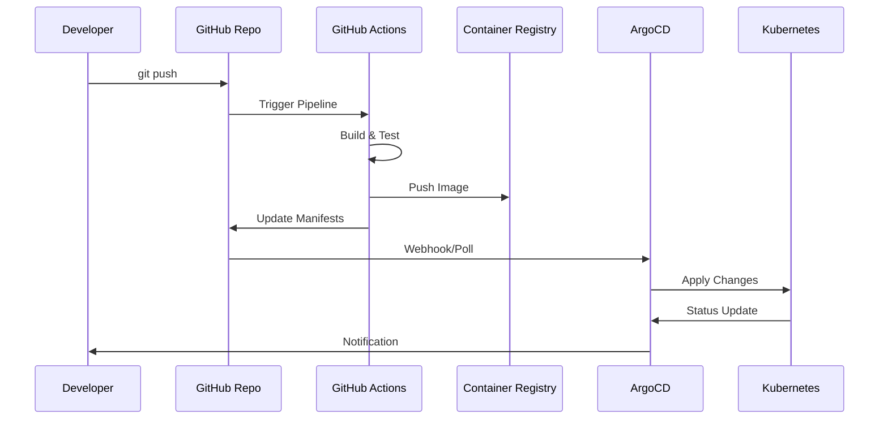
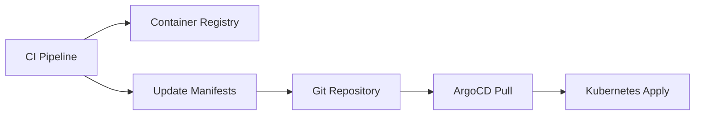
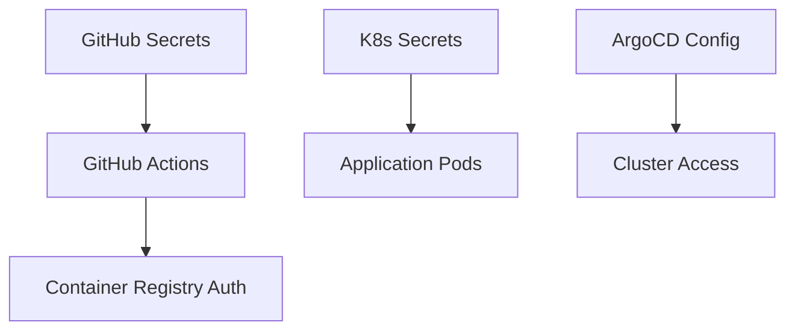

# Arquitectura del Sistema

## Cambios recientes

- El despliegue de la aplicación ahora se gestiona exclusivamente mediante un Helm chart (`chart/`).
- Los manifiestos directos (`deployment.yaml`, `service.yaml`) han sido movidos a `legacy-manifests/` y no se usan para despliegue.
- El chart Helm incluye soporte para Ingress configurable.

## Visión General

El proyecto GitOps implementa un pipeline completo de CI/CD utilizando GitOps como metodología principal, con Helm como gestor de despliegue.


## Componentes Principales

### 1. **Repositorio Git (GitHub)**
- **Función**: Source of truth para código y configuración
- **Contenido**:
  - Código fuente de la aplicación
  - Manifiestos de Kubernetes
  - Configuración de CI/CD
  - Documentación

### 2. **GitHub Actions (CI/CD Pipeline)**
- **Triggers**: Push a branch main, Pull Requests
- **Acciones**:
  - Build de la aplicación
  - Construcción de imagen Docker
  - Push al registry
  - Actualización de manifiestos K8s
  - Notificaciones

### 3. **Docker Registry (GitHub Container Registry)**
- **Función**: Almacenamiento de imágenes Docker
- **Características**:
  - Integración nativa con GitHub
  - Control de acceso granular
  - Versionado automático
  - Limpieza automática de imágenes antiguas

### 4. **Kubernetes Cluster**
- **Función**: Plataforma de ejecución
- **Componentes**:
  - **Deployments**: Gestión de pods de aplicación
  - **Services**: Exposición de servicios
  - **ConfigMaps/Secrets**: Configuración y secretos
  - **Ingress**: Routing externo



### 5. **ArgoCD (GitOps Operator)**
- **Función**: Sincronización automática Git → Kubernetes
- **Características**:
  - Monitoreo continuo del repositorio
  - Detección de drift de configuración
  - Rollback automático en caso de fallo
  - UI web para monitoreo
  - RBAC integrado


## Flujo de Datos



## Patrones de Despliegue

### Push-based GitOps


### Ventajas del Enfoque
1. **Declarativo**: Estado deseado en Git
2. **Auditable**: Historial completo en Git
3. **Reversible**: Rollback fácil con Git
4. **Seguro**: No credenciales de cluster en CI/CD
5. **Escalable**: Múltiples clusters desde un repo

## Seguridad

### Principios Implementados
- **Least Privilege**: Permisos mínimos necesarios
- **Secret Management**: Kubernetes Secrets + External Secrets
- **Image Scanning**: Vulnerabilidades en pipeline
- **Network Policies**: Aislamiento de red
- **RBAC**: Control de acceso granular

### Flujo de Secretos


## Monitoreo y Observabilidad

### Métricas Clave
- **Deployment Frequency**: Frecuencia de despliegues
- **Lead Time**: Tiempo desde código hasta producción
- **MTTR**: Tiempo medio de recuperación
- **Change Failure Rate**: Porcentaje de fallos en cambios

### Stack de Observabilidad
- **Logs**: Fluent Bit → Elasticsearch
- **Métricas**: Prometheus → Grafana
- **Traces**: Jaeger
- **Alertas**: AlertManager → Slack/Email

## Escalabilidad

### Estrategias de Escalado
- **Horizontal Pod Autoscaler**: Basado en CPU/Memoria
- **Vertical Pod Autoscaler**: Ajuste automático de recursos
- **Cluster Autoscaler**: Escalado de nodos
- **Custom Metrics**: Escalado basado en métricas de aplicación

### Multi-Environment
```
├── environments/
│   ├── dev/
│   │   └── kustomization.yaml
│   ├── staging/
│   │   └── kustomization.yaml
│   └── prod/
│       └── kustomization.yaml
```

## Disaster Recovery

### Estrategias
1. **Backup de Configuración**: Git como backup
2. **Multi-Region**: Clusters en múltiples regiones
3. **Database Backup**: Snapshots automatizados
4. **Infrastructure as Code**: Terraform para recrear
5. **Runbooks**: Procedimientos documentados

### RTO/RPO Targets
- **RTO**: < 30 minutos
- **RPO**: < 5 minutos
- **SLA**: 99.9% uptime