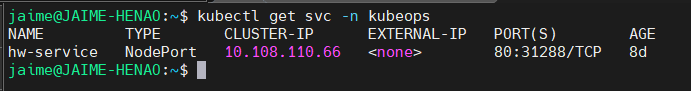
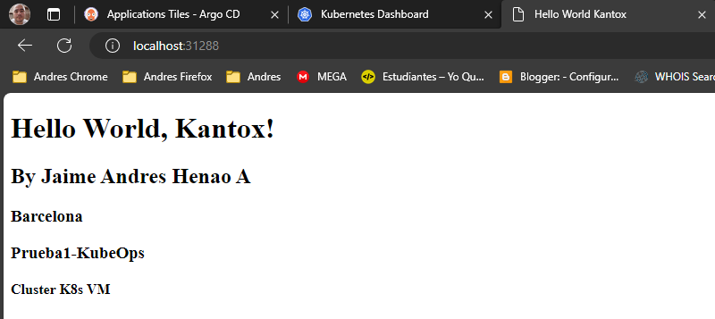

# Componentes del Sistema

## Aplicación Web

### Características Técnicas
- **Tecnología**: HTML estático servido por Nginx
- **Puerto**: 80
- **Imagen Base**: nginx:alpine
- **Tamaño**: ~5MB



### Dockerfile
```dockerfile
FROM nginx:alpine
COPY Docker/index.html /usr/share/nginx/html/
EXPOSE 80
```

### Estructura de Archivos
```
Docker/
├── Dockerfile
└── index.html
```

## Manifiestos de Kubernetes

### Deployment
```yaml
apiVersion: apps/v1
kind: Deployment
metadata:
  name: gitops-demo
  labels:
    app: gitops-demo
spec:
  replicas: 3
  selector:
    matchLabels:
      app: gitops-demo
  template:
    metadata:
      labels:
        app: gitops-demo
    spec:
      containers:
      - name: webapp
        image: ghcr.io/portfolio-jaime/gitops:latest
        ports:
        - containerPort: 80
        resources:
          requests:
            memory: "64Mi"
            cpu: "250m"
          limits:
            memory: "128Mi"
            cpu: "500m"
        livenessProbe:
          httpGet:
            path: /
            port: 80
          initialDelaySeconds: 30
          periodSeconds: 10
        readinessProbe:
          httpGet:
            path: /
            port: 80
          initialDelaySeconds: 5
          periodSeconds: 5
```


### Service
```yaml
apiVersion: v1
kind: Service
metadata:
  name: gitops-demo
  labels:
    app: gitops-demo
spec:
  type: ClusterIP
  ports:
  - port: 80
    targetPort: 80
    protocol: TCP
  selector:
    app: gitops-demo
```

### Ingress (Opcional)
```yaml
apiVersion: networking.k8s.io/v1
kind: Ingress
metadata:
  name: gitops-demo
  annotations:
    kubernetes.io/ingress.class: nginx
    cert-manager.io/cluster-issuer: letsencrypt-prod
spec:
  tls:
  - hosts:
    - gitops-demo.example.com
    secretName: gitops-demo-tls
  rules:
  - host: gitops-demo.example.com
    http:
      paths:
      - path: /
        pathType: Prefix
        backend:
          service:
            name: gitops-demo
            port:
              number: 80
```



## GitHub Actions Pipeline

### Workflow Principal (.github/workflows/cd.yml)
```yaml
name: CI/CD Pipeline

on:
  push:
    branches: [main]
  pull_request:
    branches: [main]

env:
  REGISTRY: ghcr.io
  IMAGE_NAME: ${{ github.repository }}

jobs:
  build:
    runs-on: ubuntu-latest
    permissions:
      contents: read
      packages: write

    steps:
    - name: Checkout
      uses: actions/checkout@v4

    - name: Log in to Container Registry
      uses: docker/login-action@v3
      with:
        registry: ${{ env.REGISTRY }}
        username: ${{ github.actor }}
        password: ${{ secrets.GITHUB_TOKEN }}

    - name: Extract metadata
      id: meta
      uses: docker/metadata-action@v5
      with:
        images: ${{ env.REGISTRY }}/${{ env.IMAGE_NAME }}
        tags: |
          type=ref,event=branch
          type=ref,event=pr
          type=sha,prefix={{branch}}-
          type=raw,value=latest,enable={{is_default_branch}}

    - name: Build and push Docker image
      uses: docker/build-push-action@v5
      with:
        context: .
        file: Docker/Dockerfile
        push: true
        tags: ${{ steps.meta.outputs.tags }}
        labels: ${{ steps.meta.outputs.labels }}

    - name: Update Kubernetes manifests
      if: github.ref == 'refs/heads/main'
      run: |
        sed -i 's|image: .*|image: ${{ env.REGISTRY }}/${{ env.IMAGE_NAME }}:${{ github.sha }}|' Kubernetes/deployment.yaml
        git config --local user.email "action@github.com"
        git config --local user.name "GitHub Action"
        git add Kubernetes/deployment.yaml
        git commit -m "Update image tag to ${{ github.sha }}" || exit 0
        git push
```

### Jobs y Steps
1. **Checkout**: Descargar código fuente
2. **Login**: Autenticación con GitHub Container Registry
3. **Build**: Construcción de imagen Docker
4. **Push**: Subida de imagen al registry
5. **Update Manifests**: Actualización automática de manifiestos
6. **Commit**: Push de cambios de vuelta al repositorio

### Variables de Entorno
- `REGISTRY`: Registro de contenedores (ghcr.io)
- `IMAGE_NAME`: Nombre de la imagen basado en el repositorio
- `GITHUB_TOKEN`: Token automático para autenticación

### Secrets Necesarios
- `GITHUB_TOKEN`: Generado automáticamente
- `DOCKER_REGISTRY`: URL del registry (opcional)
- `DOCKER_USERNAME`: Usuario del registry (opcional)
- `DOCKER_PASSWORD`: Password/token del registry (opcional)

## ArgoCD Configuration

### Application Manifest
```yaml
apiVersion: argoproj.io/v1alpha1
kind: Application
metadata:
  name: gitops-demo
  namespace: argocd
spec:
  project: default
  source:
    repoURL: https://github.com/Portfolio-jaime/GitOps.git
    targetRevision: HEAD
    path: Kubernetes
  destination:
    server: https://kubernetes.default.svc
    namespace: gitops-demo
  syncPolicy:
    automated:
      prune: true
      selfHeal: true
    syncOptions:
    - CreateNamespace=true
```

### Sync Policy
- **Automated**: Sincronización automática habilitada
- **Prune**: Eliminar recursos huérfanos
- **Self Heal**: Auto-corrección de drift
- **Create Namespace**: Crear namespace automáticamente

### Health Checks
ArgoCD monitoreará automáticamente:
- Estado de Deployment
- Estado de Pods
- Estado de Services
- Configuración de Ingress

## Monitoreo y Logging

### Health Checks
```yaml
# Liveness Probe
livenessProbe:
  httpGet:
    path: /
    port: 80
  initialDelaySeconds: 30
  periodSeconds: 10
  failureThreshold: 3

# Readiness Probe
readinessProbe:
  httpGet:
    path: /
    port: 80
  initialDelaySeconds: 5
  periodSeconds: 5
  failureThreshold: 3
```

### Resource Limits
```yaml
resources:
  requests:
    memory: "64Mi"
    cpu: "250m"
  limits:
    memory: "128Mi"
    cpu: "500m"
```

### Labels y Annotations
```yaml
metadata:
  labels:
    app: gitops-demo
    version: v1.0.0
    component: webapp
    part-of: gitops-demo
  annotations:
    app.kubernetes.io/name: gitops-demo
    app.kubernetes.io/version: "1.0.0"
    app.kubernetes.io/component: webapp
    app.kubernetes.io/part-of: gitops-demo
```

## Seguridad

### Container Security
- **Non-root user**: Nginx corre como usuario no-root
- **Read-only filesystem**: Sistema de archivos de solo lectura
- **Security context**: Configuración de seguridad del contenedor

### Network Policies
```yaml
apiVersion: networking.k8s.io/v1
kind: NetworkPolicy
metadata:
  name: gitops-demo-netpol
spec:
  podSelector:
    matchLabels:
      app: gitops-demo
  policyTypes:
  - Ingress
  - Egress
  ingress:
  - from:
    - namespaceSelector:
        matchLabels:
          name: ingress-nginx
  egress:
  - to: []
    ports:
    - protocol: TCP
      port: 53
    - protocol: UDP
      port: 53
```

### RBAC
```yaml
apiVersion: v1
kind: ServiceAccount
metadata:
  name: gitops-demo
  namespace: gitops-demo
---
apiVersion: rbac.authorization.k8s.io/v1
kind: Role
metadata:
  name: gitops-demo
  namespace: gitops-demo
rules:
- apiGroups: [""]
  resources: ["configmaps"]
  verbs: ["get", "list"]
---
apiVersion: rbac.authorization.k8s.io/v1
kind: RoleBinding
metadata:
  name: gitops-demo
  namespace: gitops-demo
subjects:
- kind: ServiceAccount
  name: gitops-demo
  namespace: gitops-demo
roleRef:
  kind: Role
  name: gitops-demo
  apiGroup: rbac.authorization.k8s.io
```