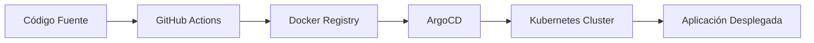

# GitOps Demo Project

Este proyecto ahora utiliza Helm para el despliegue en Kubernetes, con soporte para Ingress y pipelines modernos en GitHub Actions.

## 🎯 Objetivo

Demostrar la implementación de un flujo de trabajo GitOps completo para una aplicación web simple, incluyendo:
- Automatización de CI/CD con GitHub Actions
- Containerización con Docker
- Despliegue en Kubernetes
- Gestión de configuración con ArgoCD

## 🏗️ Arquitectura




### Vista de la Aplicación en Kubernetes


### Servicios y Networking


## 📦 Componentes

### 1. Aplicación Web
- **Tecnología**: HTML estático
- **Contenedor**: Docker con Nginx
- **Puerto**: 80

### 2. CI/CD Pipeline
- **Plataforma**: GitHub Actions
- **Trigger**: Push a main branch
- **Acciones**:
  - Build de imagen Docker
  - Push a registry
  - Actualización de manifiestos K8s

### 3. Infraestructura Kubernetes
- **Deployment**: Gestión de pods de la aplicación
- **Service**: Exposición de la aplicación
- **Ingress**: Routing externo (opcional)

### 4. GitOps con ArgoCD
- **Monitoreo**: Repositorio de manifiestos
- **Sincronización**: Automática
- **Rollback**: Capacidad de volver a versiones anteriores

## 🚀 Quick Start

### Prerrequisitos
- Cluster de Kubernetes
- kubectl configurado
- Helm instalado
- Acceso a Docker Registry

### 1. Clonar Repositorio
```bash
git clone https://github.com/Portfolio-jaime/GitOps.git
cd GitOps1
```

### 2. Desplegar con Helm
```bash
helm install gitops1 ./chart \
  --set image.repository=usuario/gitops1 \
  --set image.tag=latest
```

### 3. Configurar Ingress (opcional)
Edita `values.yaml` para personalizar el host y rutas del Ingress.

## 🧩 Componentes

- chart/: Helm chart principal (Deployment, Service, Ingress)
- Docker/: Dockerfile y recursos de la app
- legacy-manifests/: Manifiestos antiguos (solo referencia histórica)
- .github/workflows/: Pipeline CD.yml actualizado para Helm

## 📝 Notas

- Los manifiestos directos (`deployment.yaml`, `service.yaml`) han sido movidos a `legacy-manifests/` y ya no se usan para despliegue.
- Para usar ArgoCD, apunta la ruta de la app a `chart/`.

## 🔧 Configuración CI/CD

El pipeline de GitHub Actions automatiza:

1. **Build**: Construcción de imagen Docker
2. **Test**: Validaciones de seguridad y calidad
3. **Push**: Subida a Docker Registry
4. **Deploy**: Actualización de manifiestos K8s

### Variables de Entorno Requeridas
```yaml
DOCKER_REGISTRY: registry.example.com
DOCKER_USERNAME: user
DOCKER_PASSWORD: password
KUBECONFIG: base64-encoded-kubeconfig
```

## 🔄 Flujo GitOps

### 1. Desarrollo
```bash
# Modificar aplicación
echo "<h1>Nueva versión</h1>" > Docker/index.html

# Commit y push
git add .
git commit -m "feat: nueva versión de la aplicación"
git push origin main
```

### 2. CI/CD Automático
- GitHub Actions detecta el cambio
- Construye nueva imagen Docker
- Actualiza manifiestos con nueva imagen
- ArgoCD detecta cambios en Git

### 3. Despliegue
- ArgoCD sincroniza automáticamente
- Kubernetes aplica nuevos manifiestos
- Aplicación se actualiza sin downtime

## 📊 Monitoreo

### Estado de la Aplicación
```bash
# Verificar pods
kubectl get pods -l app=gitops-demo

# Ver logs
kubectl logs -l app=gitops-demo --tail=50

# Estado del servicio
kubectl get svc gitops-demo
```

### ArgoCD Dashboard
- Acceder a la UI de ArgoCD
- Verificar estado de sincronización
- Revisar historial de despliegues

## 🛠️ Troubleshooting

### Problemas Comunes

#### 1. Imagen no se actualiza
```bash
# Verificar el tag de la imagen
kubectl describe deployment gitops-demo

# Forzar actualización
kubectl rollout restart deployment/gitops-demo
```

#### 2. ArgoCD no sincroniza
```bash
# Verificar configuración de la app
argocd app get gitops-demo

# Sincronización manual
argocd app sync gitops-demo
```

#### 3. Problemas de red
```bash
# Verificar service y endpoints
kubectl get svc,endpoints

# Probar conectividad
kubectl port-forward svc/gitops-demo 8080:80
```

## 🎯 Casos de Uso

### Entornos de Desarrollo
- **Desarrollo Local**: Docker Compose para desarrollo
- **Testing**: Namespace dedicado en K8s
- **Staging**: Entorno de pre-producción

### Producción
- **Blue/Green**: Despliegues sin downtime
- **Canary**: Despliegues graduales
- **Rollback**: Vuelta rápida a versiones anteriores

## 📈 Métricas y Observabilidad

### Métricas de Aplicación
- Tiempo de respuesta
- Throughput de requests
- Errores HTTP

### Métricas de Infraestructura
- Uso de CPU y memoria
- Estado de pods
- Latencia de red

## 🔐 Seguridad

### Prácticas Implementadas
- **Imágenes**: Scan de vulnerabilidades
- **Secrets**: Gestión segura con K8s secrets
- **RBAC**: Control de acceso en ArgoCD
- **Network Policies**: Seguridad de red

## 📚 Recursos Adicionales

- [Guía de Prerequisites](prerequisites.md)
- [Setup Detallado](setup.md)
- [Arquitectura Completa](architecture.md)
- [Configuración de ArgoCD](argocd.md)
- [Troubleshooting](troubleshooting.md)

## 👥 Contribuir

Este proyecto es parte del portfolio de DevOps y está abierto a contribuciones:

1. Fork del repositorio
2. Crear feature branch
3. Commit cambios
4. Push a la branch
5. Crear Pull Request

## 📞 Contacto

**Autor:** Jaime Henao  
**Email:** jaime.andres.henao.arbelaez@ba.com  
**Organización:** British Airways DevOps Team  
**GitHub:** [@Portfolio-jaime](https://github.com/Portfolio-jaime)

---

**Proyecto de Demostración GitOps - DevOps Engineering Portfolio**