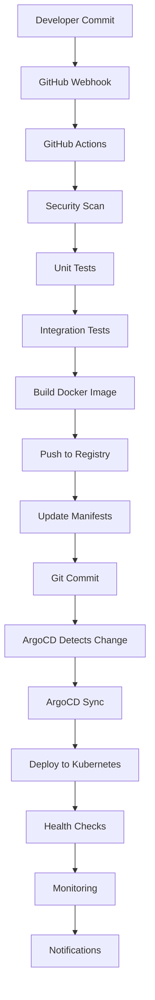

# Pipeline GitOps Completo

## Visión General del Pipeline

El pipeline GitOps implementa un flujo automatizado desde el desarrollo hasta la producción, siguiendo las mejores prácticas de DevOps y GitOps.



## Fases del Pipeline

### 1. Fase de Validación

#### Security Scanning
```yaml
- name: Trivy Filesystem Scan
  uses: aquasecurity/trivy-action@master
  with:
    scan-type: 'fs'
    scan-ref: '.'
    format: 'sarif'
    severity: 'CRITICAL,HIGH,MEDIUM'

- name: Hadolint Dockerfile Scan
  uses: hadolint/hadolint-action@v3.1.0
  with:
    dockerfile: Docker/Dockerfile
    failure-threshold: error
```

#### Code Quality
```yaml
- name: SonarCloud Scan
  uses: SonarSource/sonarcloud-github-action@master
  env:
    GITHUB_TOKEN: ${{ secrets.GITHUB_TOKEN }}
    SONAR_TOKEN: ${{ secrets.SONAR_TOKEN }}

- name: CodeQL Analysis
  uses: github/codeql-action/analyze@v3
  with:
    languages: javascript
```

### 2. Fase de Testing

#### Testing Strategy
```yaml
test-matrix:
  strategy:
    matrix:
      node-version: [16, 18, 20]
      os: [ubuntu-latest, windows-latest]
  
  steps:
  - name: Unit Tests
    run: |
      npm test -- --coverage
      npm run test:unit
  
  - name: Integration Tests
    run: |
      docker-compose -f docker-compose.test.yml up -d
      npm run test:integration
      docker-compose -f docker-compose.test.yml down
  
  - name: E2E Tests
    run: |
      npm run test:e2e
```

#### Performance Tests
```yaml
- name: Lighthouse Performance
  uses: treosh/lighthouse-ci-action@v10
  with:
    configPath: '.github/lighthouse/lighthouserc.json'
    uploadArtifacts: true
    temporaryPublicStorage: true
```

### 3. Fase de Build

#### Multi-platform Build
```yaml
- name: Set up Docker Buildx
  uses: docker/setup-buildx-action@v3
  with:
    platforms: linux/amd64,linux/arm64

- name: Build Multi-arch Image
  uses: docker/build-push-action@v5
  with:
    context: .
    file: Docker/Dockerfile
    platforms: linux/amd64,linux/arm64
    push: true
    tags: |
      ${{ env.REGISTRY }}/${{ env.IMAGE_NAME }}:${{ github.sha }}
      ${{ env.REGISTRY }}/${{ env.IMAGE_NAME }}:latest
    cache-from: type=gha
    cache-to: type=gha,mode=max
```

#### Image Optimization
```yaml
- name: Optimize Image
  run: |
    # Usar dive para analizar layers
    docker run --rm -v /var/run/docker.sock:/var/run/docker.sock \
      wagoodman/dive:latest \
      ${{ env.REGISTRY }}/${{ env.IMAGE_NAME }}:${{ github.sha }} \
      --ci \
      --lowestEfficiency=0.95
```

### 4. Fase de Deployment

#### GitOps Update
```yaml
- name: Update Kubernetes Manifests
  run: |
    # Clonar el repositorio de configuración
    git clone https://github.com/Portfolio-jaime/gitops-config.git
    cd gitops-config
    
    # Actualizar imagen en múltiples entornos
    environments=("dev" "staging" "prod")
    for env in "${environments[@]}"; do
      if [[ "${{ github.ref }}" == "refs/heads/main" ]] || [[ "$env" == "dev" ]]; then
        yq eval ".spec.template.spec.containers[0].image = \"${{ env.REGISTRY }}/${{ env.IMAGE_NAME }}:${{ github.sha }}\"" \
          -i environments/$env/deployment.yaml
      fi
    done
    
    # Commit y push
    git add .
    git commit -m "Update ${{ github.repository }} to ${{ github.sha }}"
    git push
```

#### Rollback Strategy
```yaml
- name: Prepare Rollback
  if: failure()
  run: |
    # Guardar información para rollback
    echo "${{ github.sha }}" > .previous-version
    echo "PREVIOUS_SHA=$(git rev-parse HEAD~1)" >> $GITHUB_ENV
    
    # Revertir cambios si el deployment falla
    git revert --no-edit HEAD
    git push
```

## Configuración Avanzada

### Pipeline Paralelo
```yaml
jobs:
  # Jobs que pueden ejecutarse en paralelo
  security-scan:
    runs-on: ubuntu-latest
    # ... configuración

  unit-tests:
    runs-on: ubuntu-latest
    # ... configuración

  integration-tests:
    runs-on: ubuntu-latest
    needs: [unit-tests]
    # ... configuración

  # Job que depende de múltiples jobs
  deploy:
    runs-on: ubuntu-latest
    needs: [security-scan, unit-tests, integration-tests]
    # ... configuración
```

### Conditional Deployments
```yaml
- name: Deploy to Development
  if: github.ref == 'refs/heads/develop'
  run: |
    # Deploy logic for dev environment

- name: Deploy to Staging
  if: github.ref == 'refs/heads/main' && contains(github.event.head_commit.message, '[staging]')
  run: |
    # Deploy logic for staging environment

- name: Deploy to Production
  if: startsWith(github.ref, 'refs/tags/')
  run: |
    # Deploy logic for production environment
```

### Environment-specific Configuration
```yaml
strategy:
  matrix:
    environment: [dev, staging, prod]
    include:
      - environment: dev
        namespace: gitops-dev
        replicas: 1
        resources_requests_cpu: 100m
        resources_requests_memory: 128Mi
      - environment: staging
        namespace: gitops-staging
        replicas: 2
        resources_requests_cpu: 200m
        resources_requests_memory: 256Mi
      - environment: prod
        namespace: gitops-prod
        replicas: 3
        resources_requests_cpu: 500m
        resources_requests_memory: 512Mi
```

## Monitoreo del Pipeline

### Pipeline Metrics
```yaml
- name: Record Pipeline Metrics
  uses: ./.github/actions/record-metrics
  with:
    metric-name: pipeline_duration
    value: ${{ env.PIPELINE_START_TIME }}
    labels: |
      branch=${{ github.ref_name }}
      environment=${{ matrix.environment }}
      success=${{ job.status == 'success' }}
```

### Alerting Configuration
```yaml
- name: Pipeline Failure Alert
  if: failure()
  uses: rtCamp/action-slack-notify@v2
  env:
    SLACK_WEBHOOK: ${{ secrets.SLACK_WEBHOOK }}
    SLACK_COLOR: danger
    SLACK_MESSAGE: |
      🚨 Pipeline FAILED!
      
      Repository: ${{ github.repository }}
      Branch: ${{ github.ref_name }}
      Commit: ${{ github.sha }}
      Job: ${{ github.job }}
      
      Check the logs: ${{ github.server_url }}/${{ github.repository }}/actions/runs/${{ github.run_id }}
```

## Mejores Prácticas Implementadas

### 1. Fail Fast Strategy
```yaml
# Fallar rápido en validaciones básicas
jobs:
  quick-checks:
    runs-on: ubuntu-latest
    steps:
    - name: Lint Dockerfile
      run: hadolint Docker/Dockerfile
    
    - name: Validate Kubernetes manifests
      run: |
        kubectl --dry-run=client apply -f Kubernetes/
    
    - name: Check commit message format
      run: |
        if ! echo "${{ github.event.head_commit.message }}" | grep -qE '^(feat|fix|docs|style|refactor|test|chore)(\(.+\))?: .+'; then
          echo "Commit message doesn't follow conventional commits format"
          exit 1
        fi
```

### 2. Caching Strategy
```yaml
- name: Cache Docker layers
  uses: actions/cache@v3
  with:
    path: /tmp/.buildx-cache
    key: ${{ runner.os }}-buildx-${{ github.sha }}
    restore-keys: |
      ${{ runner.os }}-buildx-

- name: Cache npm dependencies
  uses: actions/cache@v3
  with:
    path: ~/.npm
    key: ${{ runner.os }}-node-${{ hashFiles('**/package-lock.json') }}
    restore-keys: |
      ${{ runner.os }}-node-
```

### 3. Security Best Practices
```yaml
# Usar GITHUB_TOKEN en lugar de PAT cuando sea posible
- name: Checkout with minimal permissions
  uses: actions/checkout@v4
  with:
    token: ${{ secrets.GITHUB_TOKEN }}
    persist-credentials: false

# Pinned versions para acciones
- uses: actions/checkout@v4.1.1
- uses: docker/build-push-action@v5.1.0
- uses: docker/setup-buildx-action@v3.0.0
```

### 4. Resource Optimization
```yaml
# Limitar recursos del runner
jobs:
  build:
    runs-on: ubuntu-latest
    timeout-minutes: 30
    env:
      DOCKER_BUILDKIT: 1
      BUILDX_NO_DEFAULT_ATTESTATIONS: 1
```

## Troubleshooting del Pipeline

### Debugging Steps
```yaml
- name: Debug Information
  if: failure()
  run: |
    echo "=== Environment Information ==="
    env | sort
    
    echo "=== Docker Information ==="
    docker version
    docker system df
    
    echo "=== Git Information ==="
    git log --oneline -5
    git status
    
    echo "=== File System ==="
    ls -la
    du -sh * 2>/dev/null | head -10
```

### Common Issues and Solutions

#### Build Failures
```bash
# Problema: Out of disk space
# Solución: Limpiar caché Docker
- name: Clean Docker
  run: |
    docker system prune -a -f
    docker volume prune -f

# Problema: Network timeout
# Solución: Retry logic
- name: Build with retry
  uses: nick-invision/retry@v2
  with:
    timeout_minutes: 10
    max_attempts: 3
    command: docker build -t myapp .
```

#### Test Failures
```bash
# Problema: Tests flaky
# Solución: Rerun failed tests
- name: Run tests with retry
  run: |
    for i in {1..3}; do
      npm test && break
      echo "Test attempt $i failed, retrying..."
      sleep 5
    done
```

### Pipeline Performance Optimization

#### Parallel Execution
```yaml
jobs:
  build-matrix:
    strategy:
      matrix:
        component: [frontend, backend, database]
      max-parallel: 3
    runs-on: ubuntu-latest
    steps:
    - name: Build ${{ matrix.component }}
      run: |
        docker build -t ${{ matrix.component }} -f Docker/Dockerfile.${{ matrix.component }} .
```

#### Conditional Execution
```yaml
- name: Skip if no changes
  uses: dorny/paths-filter@v2
  id: changes
  with:
    filters: |
      docker:
        - 'Docker/**'
      k8s:
        - 'Kubernetes/**'
      code:
        - 'src/**'

- name: Build only if code changed
  if: steps.changes.outputs.code == 'true'
  run: docker build -t myapp .
```

## Métricas y Observabilidad

### DORA Metrics
```yaml
# Deployment Frequency
- name: Record Deployment
  run: |
    echo "deployment_timestamp=$(date +%s)" >> deployment_metrics.txt
    echo "deployment_frequency=1" >> deployment_metrics.txt

# Lead Time
- name: Calculate Lead Time
  run: |
    COMMIT_TIME=$(git show -s --format=%ct ${{ github.sha }})
    DEPLOY_TIME=$(date +%s)
    LEAD_TIME=$((DEPLOY_TIME - COMMIT_TIME))
    echo "lead_time_seconds=$LEAD_TIME" >> deployment_metrics.txt

# Change Failure Rate
- name: Record Success/Failure
  if: always()
  run: |
    if [[ "${{ job.status }}" == "success" ]]; then
      echo "deployment_success=1" >> deployment_metrics.txt
    else
      echo "deployment_failure=1" >> deployment_metrics.txt
    fi
```